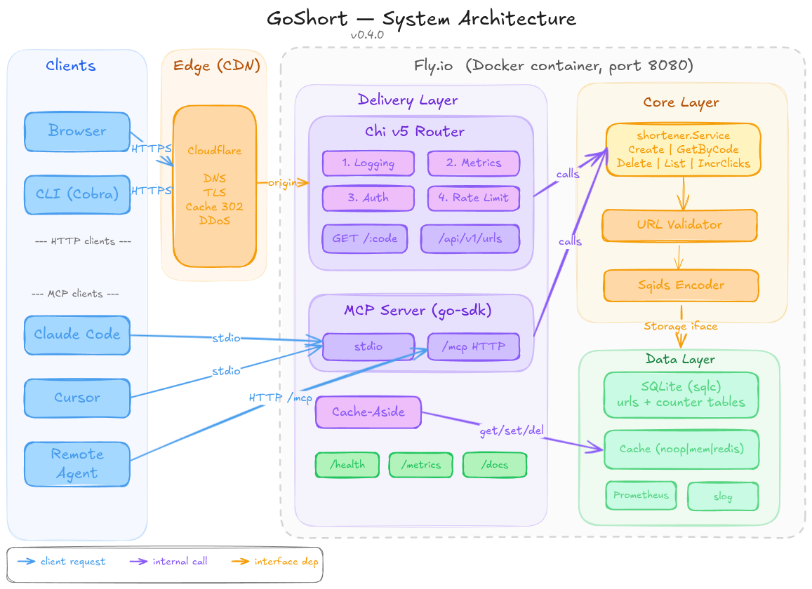

<h1 align="center">🔗 GoShort</h1>

<p align="center">
  Self-hosted URL shortener — single binary, SQLite-backed, zero config to start.
</p>

<p align="center">
  <sub>Turn long URLs into short, shareable links with click tracking, custom aliases, and AI agent integration.</sub>
</p>

<p align="center">
  <a href="https://github.com/anIcedAntFA/goshort/actions/workflows/ci.yml">
    
  </a>
  <a href="https://codecov.io/gh/anIcedAntFA/goshort">
    
  </a>
  <a href="https://goreportcard.com/report/github.com/anIcedAntFA/goshort">
    
  </a>
  <a href="https://github.com/anIcedAntFA/goshort/releases/latest">
    
  </a>
  <a href="LICENSE">
    
  </a>
  <a href="go.mod">
    
  </a>
</p>

<p align="center">
  
</p>

---

## ✨ Features

- **Zero-collision codes** — atomic SQLite counter + [Sqids](https://sqids.org): non-sequential, bijective, no retry loops
- **Custom aliases** — bring your own slug (`/my-link`); charset isolation prevents collision with generated codes
- **URL expiration** — configurable TTL with lazy expiry on read + hourly background cleanup
- **Switchable cache** — `none | memory | redis` at config time; cache-aside with TTL capped to remaining expiry
- **API key auth** — constant-time comparison; per-IP token bucket rate limiting
- **CLI client** — `goshort-cli` for shorten, list, stats, delete from the terminal
- **MCP server** — AI agents (Claude Code, Cursor) can shorten, list, and manage URLs via [Model Context Protocol](https://modelcontextprotocol.io)
- **Prometheus metrics + structured logs** — `/metrics` endpoint, `slog` throughout, no extra dependencies
- **Self-documenting API** — OpenAPI 3.1 spec + interactive Scalar UI at `/docs`

---

## 🏗️ Architecture



Full architecture diagrams: [high-level](docs/sys-arch.png), [request flow](docs/request-flow.excalidraw), [layer boundaries](docs/layers.excalidraw).

---

## 🛠️ Tech Stack

| Component      | Technology                                                    |
|----------------|---------------------------------------------------------------|
| Language       | Go 1.26                                                       |
| HTTP           | [Chi](https://go-chi.io) v5                                   |
| Database       | SQLite via [sqlc](https://sqlc.dev) (pure Go, no CGO)         |
| Encoding       | [Sqids](https://sqids.org) (zero-collision, non-sequential)   |
| CLI            | [Cobra](https://cobra.dev)                                    |
| Config         | [Koanf](https://github.com/knadh/koanf) v2 (TOML + env vars) |
| Cache          | [go-redis](https://github.com/redis/go-redis) v9              |
| Metrics        | [Prometheus](https://github.com/prometheus/prometheus)        |
| Rate Limit     | [rate](https://pkg.go.dev/golang.org/x/time/rate) (token bucket) |
| MCP            | [go-sdk](https://github.com/modelcontextprotocol/go-sdk) v1.6 (official) |
| Reverse Proxy  | [Caddy](https://github.com/caddyserver/caddy) (Docker Compose) |
| Release        | [GoReleaser](https://github.com/goreleaser/goreleaser) + [GitHub Actions](https://github.com/features/actions) |

---

## 🚀 Quick Start

### a. Docker Compose (recommended)

```bash
curl -O https://raw.githubusercontent.com/anIcedAntFA/goshort/main/docker-compose.yml
curl -O https://raw.githubusercontent.com/anIcedAntFA/goshort/main/goshort.toml
docker compose up -d
```

Caddy handles TLS automatically. Edit `goshort.toml` to set your `base_url` and `api_key`.

### b. Binary (GitHub Releases)

```bash
curl -L https://github.com/anIcedAntFA/goshort/releases/latest/download/goshort_linux_amd64.tar.gz | tar xz
./goshort
```

Grab `goshort_darwin_arm64`, `goshort_windows_amd64`, etc. from the [releases page](https://github.com/anIcedAntFA/goshort/releases).

### c. go install

```bash
go install github.com/anIcedAntFA/goshort/cmd/server@latest
goshort
```

---

## 📡 Usage

**Create a short URL:**

```bash
curl -s -X POST http://localhost:8080/api/v1/urls \
  -H "Content-Type: application/json" \
  -H "X-API-Key: your-api-key" \
  -d '{"url": "https://example.com/very/long/path", "expires_in": "30d"}'
```

```json
{
  "short_code": "k7Xm2p",
  "short_url":  "http://localhost:8080/k7Xm2p",
  "original_url": "https://example.com/very/long/path",
  "expires_at": "2025-08-01T00:00:00Z"
}
```

**Redirect:**

```bash
curl -L http://localhost:8080/k7Xm2p
# → 302 to https://example.com/very/long/path
```

---

## 💻 CLI

```bash
# Install
go install github.com/anIcedAntFA/goshort/cmd/cli@latest

# Shorten a URL
goshort-cli shorten https://example.com/long --alias my-link --expires 7d

# List all URLs (paginated)
goshort-cli list --page 1 --per-page 20

# Inspect a short code or alias
goshort-cli stats k7Xm2p

# Delete a short URL
goshort-cli delete k7Xm2p
```

Config file (`~/.goshort.toml`):

```toml
server_url = "http://localhost:8080"
api_key    = "your-api-key"
```

Per-command overrides (precedence: flag > env > config):

| Flag         | Env var              |
|--------------|----------------------|
| `--server`   | `GOSHORT_SERVER_URL` |
| `--api-key`  | `GOSHORT_API_KEY`    |
| `--json`     | —                    |

---

## 🤖 MCP (AI Agent Integration)

GoShort ships an [MCP](https://modelcontextprotocol.io) server so AI agents like Claude Code and Cursor can shorten, list, and manage URLs directly.

### Local — stdio

```bash
make build
```

`.mcp.json` (already included in repo):

```json
{
  "mcpServers": {
    "goshort": {
      "command": "./bin/goshort",
      "args": ["--mcp"],
      "env": { "GOSHORT_STORAGE_SQLITE_PATH": "./data/goshort.db" }
    }
  }
}
```

### Remote — Streamable HTTP

The `/mcp` endpoint is served on the main port alongside the REST API. No separate server needed.

```bash
# Connect Claude Code to deployed instance
claude mcp add goshort-remote \
  --transport http \
  https://goshort.app/mcp \
  --header "X-API-Key: your-api-key"
```

### Tools

| Tool | Description |
|------|-------------|
| `shorten_url` | Create a short URL (alias + expiry optional) |
| `list_urls` | List URLs with pagination |
| `get_url_stats` | Click count and full details for a URL |
| `delete_url` | Delete a short URL |
| `lookup_url` | Resolve a short code to its original URL |

### Resources

| URI | Description |
|-----|-------------|
| `goshort://stats/summary` | Total URL count and top URLs by clicks |
| `goshort://urls/{code}` | Full details for a specific short code |

### Prompts

| Prompt | Description |
|--------|-------------|
| `shorten_and_share` | Shorten + format for sharing (platform-aware) |
| `batch_shorten` | Shorten multiple URLs and return a table |

---

## ⚙️ Configuration

```toml
[server]
port     = 8080
base_url = "https://short.yourdomain.com"  # used in API responses

[storage]
driver      = "sqlite"              # sqlite | postgres (Phase 5+)
sqlite_path = "./data/goshort.db"

[cache]
driver    = "none"                  # none | memory | redis
redis_url = "redis://localhost:6379"

[auth]
api_key = ""                        # empty = no auth

[rate_limit]
enabled             = false
requests_per_minute = 60            # per IP, token bucket

[shortener]
code_length    = 6
default_expiry = "0"                # "0" = no expiry; or "30d", "1h"

[logging]
level  = "info"                     # debug | info | warn | error
format = "json"                     # json | text

[mcp]
base_url = ""                       # override base URL for MCP responses; falls back to server.base_url
```

Env var override: every key maps to `GOSHORT_<SECTION>_<KEY>` — e.g., `GOSHORT_SERVER_PORT=9090`, `GOSHORT_AUTH_API_KEY=secret`.

---

## 📋 API

| Method   | Path                  | Auth | Description           |
|----------|-----------------------|------|-----------------------|
| `POST`   | `/api/v1/urls`        | Yes  | Create short URL      |
| `GET`    | `/api/v1/urls`        | Yes  | List URLs (paginated) |
| `GET`    | `/api/v1/urls/:code`  | Yes  | Get URL details       |
| `DELETE` | `/api/v1/urls/:code`  | Yes  | Delete short URL      |
| `GET`    | `/:code`              | No   | Redirect (302)        |
| `GET`    | `/health`             | No   | Health check          |
| `GET`    | `/metrics`            | No   | Prometheus metrics    |
| `GET`    | `/docs`               | No   | Interactive API docs  |
| `POST`   | `/mcp`                | Yes  | MCP Streamable HTTP   |

**Auth:** `X-API-Key: <key>` header. **Redirect codes:** `302 Found`, `404 Not Found`, `410 Gone` (expired).

**POST `/api/v1/urls` body:**

| Field          | Type   | Required | Notes                                      |
|----------------|--------|----------|--------------------------------------------|
| `url`          | string | Yes      | Max 2048 chars                             |
| `custom_alias` | string | No       | `^[a-zA-Z0-9-]{3,30}$`                     |
| `expires_in`   | string | No       | `1h`, `7d`, `30d`, `90d`, `365d`, `never`  |

Interactive docs at [goshort.app/docs](https://goshort.app/docs).

---

## 📁 Project Structure

```
cmd/
├── server/main.go          # HTTP server + MCP wiring entry point
└── cli/                    # CLI entry point + subcommands (Cobra)

internal/
├── api/                    # Chi router, handlers, middleware, error types
│   ├── router.go           #   route definitions, Scalar docs
│   ├── handler.go          #   CRUD handlers + redirect + cache-aside
│   ├── middleware.go        #   auth, rate limit, logging, metrics
│   └── errors.go           #   error → HTTP status mapping
├── mcp/                    # MCP server (Phase 4)
│   ├── server.go           #   server setup, RunStdio, RunHTTP, HTTPHandler
│   ├── tools.go            #   5 tool handlers (shorten, list, stats, delete, lookup)
│   ├── resources.go        #   stats summary + URL detail resources
│   ├── prompts.go          #   shorten_and_share, batch_shorten
│   └── auth.go             #   APIKeyMiddleware for /mcp endpoint
├── shortener/              # Core business logic
│   ├── service.go          #   Service interface (5 methods)
│   ├── service_impl.go     #   ServiceImpl struct + business rules
│   ├── storage.go          #   Storage interface (consumer-defined)
│   ├── cache.go            #   Cache interface (consumer-defined)
│   ├── encoder.go          #   Encoder interface (consumer-defined)
│   ├── validator.go        #   URL, alias, expiry validation
│   ├── model.go            #   URL struct, CreateRequest, ListOptions
│   └── errors.go           #   sentinel errors (ErrNotFound, ErrExpired, ...)
├── encoder/                # Sqids-based short code generation
├── storage/                # SQLite storage (sqlc-generated queries)
├── cache/                  # noop, memory (sync.Map), Redis implementations
└── config/                 # Koanf config loading (TOML + env vars)

db/
├── schema.sql              # Table definitions (urls, counter)
├── queries.sql             # All SQL queries (sqlc input)
└── sqlc.yaml               # sqlc code generation config

docs/
├── DESIGN.md               # Full system design and architecture rationale
├── LEARNING.md             # Go patterns and GoShort-specific knowledge map
├── DEPLOYMENT.md           # Fly.io, Cloudflare, Docker Compose deployment guide
├── ROADMAP.md              # Task-level roadmap with checkboxes
└── openapi.yaml            # OpenAPI 3.1 spec (served at /docs)

api-tests/                  # Bruno API tests (.bru files)
docker-compose.yml          # Production: GoShort + Caddy (auto-TLS)
docker-compose.dev.yml      # Development: Redis only (throwaway, no persistence)
goshort.toml                # Example server config
```

---

## 🧑‍💻 Development

```bash
git clone https://github.com/anIcedAntFA/goshort
cd goshort
lefthook install        # install git hooks (once after clone)
make help               # list all targets
```

### Make targets

| Target                | What it does                                        |
|-----------------------|-----------------------------------------------------|
| `make build`          | Build server + CLI binaries into `bin/`             |
| `make run`            | Run the server (pass `CONFIG=goshort.toml` for file)|
| `make test`           | `go test ./...` (unit tests only)                   |
| `make test/race`      | Unit tests with race detector                       |
| `make test/cover`     | Coverage report opened in browser                   |
| `make test/redis`     | All tests including Redis integration tests         |
| `make test/all`       | Auto-detect Redis and run unit + integration tests  |
| `make lint`           | `golangci-lint run`                                 |
| `make lint/fix`       | Lint + auto-fix                                     |
| `make sqlc`           | Regenerate type-safe Go from SQL                    |
| `make dev/redis`      | Start throwaway Redis container on `localhost:6379` |
| `make dev/redis/stop` | Stop local Redis                                    |
| `make docker/up`      | `docker compose up -d` (production stack)           |
| `make docker/down`    | Stop production stack                               |
| `make clean`          | Remove binaries and coverage artifacts              |

### Redis integration tests

```bash
make dev/redis          # start throwaway Redis (Docker)
make test/redis         # run all tests including Redis
make dev/redis/stop     # stop when done
```

`make test/all` auto-detects whether Redis is running and adjusts accordingly.

**Git hooks (lefthook):** `pre-commit` lints staged files + secrets scan; `pre-push` runs full test suite with race detector; `commit-msg` enforces [Conventional Commits](https://www.conventionalcommits.org) with gitmoji.

See [CONTRIBUTING.md](CONTRIBUTING.md) for the full workflow.

---

## 🚢 Deployment

See [`docs/DEPLOYMENT.md`](docs/DEPLOYMENT.md) for comprehensive guides.

**Docker Compose** — GoShort + Caddy (auto-TLS):

```bash
docker compose up -d
```

**Fly.io** — currently running at [goshort.app](https://goshort.app):

```bash
fly launch && fly deploy
```

**Bare VPS** — Nginx + systemd + Certbot (see DEPLOYMENT.md)

---

## 🗺️ Roadmap

| Phase | Focus                                           | Status             |
|-------|-------------------------------------------------|--------------------|
| 1     | Core library — SQLite, sqlc, Sqids, TDD         | ✅ v0.1.0          |
| 2     | HTTP API, caching, config, Prometheus           | ✅ v0.2.0          |
| 3     | Auth, rate limiting, CLI, Docker, release infra | ✅ v0.3.0          |
| 3.5   | Deploy — Fly.io + Cloudflare CDN                | ✅ [goshort.app](https://goshort.app) |
| 4     | MCP server — Claude / Cursor integration        | ✅ v0.4.0          |
| 5+    | Analytics, PostgreSQL, Redis counter, AI agent  | 🔲                 |

Each phase ships a working, deployable product.

---

## ⭐ Star History

[](https://star-history.com/#anIcedAntFA/goshort&Date)

---

## 📄 License

MIT — see [LICENSE](LICENSE).
